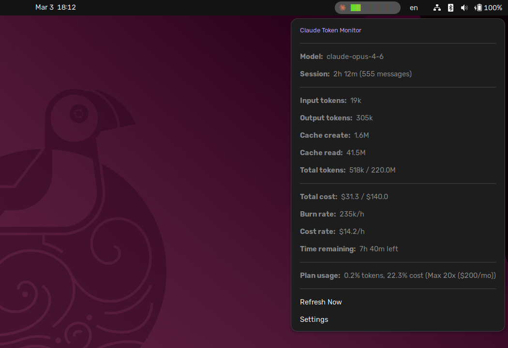

# Claude Token Monitor

A GNOME Shell extension that monitors [Claude Code](https://docs.anthropic.com/en/docs/claude-code) token usage in real-time from your taskbar.

It fetches live utilization from Anthropic's API when available, and falls back to reading JSONL data files (`~/.claude/projects/**/*.jsonl`) to calculate cost and burn rate locally. Displays a progress bar indicator with a click-to-expand dropdown for details.




## Features

- **Real API rate limits** — fetches live utilization from Anthropic's API (Pro/Max plans), with automatic fallback to local heuristic estimation
- **Progress bar** showing cost or token usage against plan limits (Pro, Max 5x, Max 20x)
- **Individual toggles**: show/hide icon, bar, percentage, time, status dot independently
- **Time remaining** estimate until plan limit is reached, or reset countdown
- **Bar styles**: Unicode (blocks, dots, squares, thin, smooth) + Cairo-rendered (pill, thick-rounded, segmented, glow-edge) + vertical (vbar, vbar-dual)
- **Color schemes**: white, green-red, blue, purple, amber, rainbow, dracula, nord, catppuccin, neon, sunset, ocean, solarized, system accent, custom gradient
- **Pill backgrounds**: off, solid, subtle, border-only, status-aware, neon glow
- **Prefix options**: "Claude" text, Claude icon, or symbolic SVG icon (theme-adaptive)
- **Animations**: smooth bar fill, pulse at high usage, icon spin on refresh, label fade
- **Middle-click** to cycle bar styles
- **Dropdown styles**: classic (text rows), modern (progress bar + sparkline + colored dots), gauges (circular arc gauges)
- **Custom colors**: user-defined gradient via color picker in preferences

## Requirements

- GNOME Shell 42 or later
- Claude Code with an active session (`~/.claude/projects/` must exist)
- For live API data: an active Claude Pro or Max subscription with a valid OAuth token at `~/.claude/.credentials.json`

## Installation

1. Clone the repository:

   ```bash
   git clone https://github.com/miferco97/claude-monitor-gnome-extension.git
   ```

2. Create a symlink to the GNOME Shell extensions directory:

   ```bash
   ln -s ~/claude-monitor-gnome-extension \
     ~/.local/share/gnome-shell/extensions/claude-monitor@miferco97
   ```

3. Compile the GSettings schema:

   ```bash
   cd ~/claude-monitor-gnome-extension
   glib-compile-schemas schemas/
   ```

4. Restart GNOME Shell:
   - **Wayland**: Log out and log back in.
   - **X11**: Press `Alt+F2`, type `r`, and press Enter.

5. Enable the extension:

   ```bash
   gnome-extensions enable claude-monitor@miferco97
   ```

   > **Note (GNOME 42/43/44):** If the extension shows as "Out of Date", run:
   > ```bash
   > gsettings set org.gnome.shell disable-extension-version-validation true
   > gnome-extensions enable claude-monitor@miferco97
   > ```

## Configuration

Open the preferences window from the dropdown menu ("Settings") or via:

```bash
gnome-extensions prefs claude-monitor@miferco97
```

### General

| Setting | Options | Description |
|---------|---------|-------------|
| Plan Type | Pro, Max 5x, Max 20x | Sets token and cost limits for the usage bar |
| Estimation Mode | Conservative, Balanced, Generous | Scales heuristic estimates (used when API is unavailable) |
| Data Source Mode | Hybrid, API only | How to combine API and heuristic data |
| API Fetch Interval | 10–3600 s | How often to call the Anthropic API |
| Bar Metric | Cost, Tokens | What the progress bar represents |
| Refresh Interval | 5–120 s | How often to re-read local data files |
| Panel Position | Left, Right | Which side of the top bar |

### Appearance

| Setting | Options | Description |
|---------|---------|-------------|
| Show Icon / Bar / Percentage / Time / Dot | On/Off | Toggle each panel element independently |
| Time Display | None, Remaining, Reset | What time info to show |
| Prefix Style | Text, Icon, Symbolic | Label before the bar |
| Bar Style | blocks, smooth, dots, squares, thin, pill, thick-rounded, segmented, glow-edge, vbar, vbar-dual | Visual style (middle-click to cycle) |
| Bar Color | 15 schemes + custom gradient | Color scheme for the bar |
| Pill Background | off, solid, subtle, border-only, status, glow | Background style for the panel button |
| Dropdown Style | Classic, Modern, Gauges | Style for the click-to-expand menu |

## How It Works

### Primary: Anthropic API

When a valid OAuth token exists at `~/.claude/.credentials.json`, the extension calls `GET https://api.anthropic.com/api/oauth/usage` to get real utilization percentages directly from Anthropic's servers. The dropdown shows **"Data source: Anthropic API"** when this is active.

### Fallback: Local Heuristic

When the API is unavailable (no token, expired, network error), the extension reads JSONL logs from `~/.claude/projects/` and estimates usage locally:

1. **Finds recent files** — scans for `.jsonl` files in the current session window (data-driven, not fixed UTC blocks).
2. **Deduplicates entries** — keeps the first entry per `message_id:request_id` to avoid counting streaming partials.
3. **Calculates per-model costs** — each entry is priced by its model tier (Opus, Sonnet, Haiku).
4. **Applies estimation scaling** — configurable multiplier (0.8×/1.0×/1.2×) to approximate Anthropic's server-side numbers.

The dropdown shows **"Data source: Heuristic (reason)"** with the specific fallback reason.

## File Structure

```
├── extension.js      # Main indicator logic, API fetch, data parsing, Cairo rendering
├── prefs.js          # GTK4/Adw preferences window
├── stylesheet.css    # Panel styling
├── metadata.json     # GNOME Shell extension metadata
├── schemas/          # GSettings schema
│   └── org.gnome.shell.extensions.claude-monitor.gschema.xml
└── icons/            # Claude logo PNGs (16px, 32px, 48px) + claude-symbolic.svg
```

## Development

- On Wayland, `disable`/`enable` via D-Bus reloads settings but **not** JS code changes — a full session restart is required to pick up `extension.js` changes.
- After modifying the GSettings schema, recompile:

  ```bash
  glib-compile-schemas schemas/
  ```

- View extension logs:

  ```bash
  journalctl -f -o cat /usr/bin/gnome-shell
  ```

## Acknowledgements

Inspired by [Claude Code Usage Monitor](https://github.com/Maciek-roboblog/Claude-Code-Usage-Monitor).

## License

MIT
